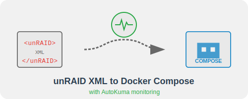

<div align="center">
  
</div>

# unRAID XML to Docker Compose Converter

A web-based tool to convert unRAID Docker container XML configurations to Docker Compose YAML format, with support for AutoKuma monitoring labels.

## Features

### XML Converter
- Convert unRAID Docker container XML data to Docker Compose YAML format
- Preserves container settings:
  - Image and container name
  - Environment variables
  - Volume mounts (with read-only flags)
  - Port mappings (with protocols)
  - Network configuration
  - CPU and memory limits
  - Privileged mode
  - Restart policy
  - WebUI, Support, and Project URLs (as labels)
- Copy the generated YAML to clipboard or download as a file

### AutoKuma Labels
- Add [Uptime Kuma](https://github.com/louislam/uptime-kuma) monitoring labels to existing Docker Compose configurations
- Support for multiple monitor types:
  - Group monitors for organizing your monitoring
  - Docker container monitors
  - HTTP endpoint monitors
  - Port monitors
- Configurable monitor settings:
  - Check intervals
  - Retry intervals
  - Max retries
  - Timeouts
  - Keywords (for HTTP monitors)
- Apply labels to specific services
- Preview, copy, and download the modified Docker Compose YAML

## Installation

### Prerequisites

- Python 3.7+
- Flask
- PyYAML

### Installation Methods

#### Method 1: Local Installation

1. Clone the repository:
```bash
git clone https://git.blakbox.vip/baxterblk/unraid-to-compose.git
cd unraid-to-compose
```

2. Install dependencies:
```bash
pip install -r requirements.txt
```

3. Run the application:
```bash
python app.py
```

The application will be available at http://localhost:5000

#### Method 2: Docker Deployment (Recommended)

##### Option A: Build from repository

1. Clone the repository:
```bash
git clone https://git.blakbox.vip/baxterblk/unraid-to-compose.git
cd unraid-to-compose
```

2. Build and start the Docker container:
```bash
docker-compose up -d --build
```

Alternatively, you can use the following commands:
```bash
docker build -t unraid-to-compose .
docker run -d -p 8080:5000 --name unraid-to-compose unraid-to-compose
```

##### Option B: Direct Docker Deployment (No local repository clone needed)

If you prefer not to clone the repository locally, you can build directly from the Git repository URL:

1. Create a docker-compose.yml file with the following content:
```yaml
version: '3.8'

services:
  unraid-to-compose:
    build:
      context: https://git.blakbox.vip/baxterblk/unraid-to-compose.git
    ports:
      - "8080:5000"
    restart: unless-stopped
```

2. Run the container:
```bash
docker-compose up -d
```

This approach will automatically:
1. Pull the source code from the Git repository
2. Build the Docker image locally
3. Start the container

The application will be available at http://localhost:8080

#### Method 3: unRAID Docker Template

To run this application directly on your unRAID server:

1. In the unRAID Docker tab, click "Add Container"
2. In the "Template" dropdown, select "... Show more templates"
3. Search for "unraid-to-compose" or add a template URL if available
4. Adjust port mappings if needed (default is 8080)
5. Click "Apply"

The application will be available at http://your-unraid-ip:8080

## Usage Guide

### Converting unRAID XML to Docker Compose

1. Navigate to the XML Converter tab
2. Obtain your unRAID Docker container XML:
   - In unRAID, go to Docker tab
   - Click on the container you want to convert
   - View the XML data in the container details
   - Copy the entire XML content
3. Paste the XML data into the input box
4. Click "Convert"
5. Review the generated Docker Compose YAML
6. Use the "Copy to Clipboard" or "Download as docker-compose.yml" buttons to save the result

### Adding AutoKuma Labels

1. Navigate to the AutoKuma Labels tab
2. Paste your existing `docker-compose.yml` content into the input box
3. Configure monitors by using the buttons to add different monitor types:
   - Group monitors: Organize your monitors in logical groups
   - Docker monitors: Monitor container state
   - HTTP monitors: Check web endpoints
   - Port monitors: Verify if a port is open and responding
4. For each monitor, fill in the required fields:
   - All monitors require an ID and Name
   - Docker monitors require a container name
   - HTTP monitors require a URL
   - Port monitors require hostname and port number
5. Click "Generate Compose with Labels" to add the configured monitors to your compose file
6. Review the generated YAML with AutoKuma labels
7. Use the "Copy to Clipboard" or "Download as docker-compose.yml" buttons to save the result

## Understanding AutoKuma Labels

Uptime Kuma is a fantastic open-source monitoring tool, and [AutoKuma](https://github.com/UniverseDevel/autokuma) extends it by allowing Docker containers to self-register for monitoring via Docker labels.

This tool helps you create those labels in the correct format. Common label patterns include:

### Group Monitor
```yaml
labels:
  - "kuma.group.id=services-group"
  - "kuma.group.name=Web Services"
  - "kuma.group.description=Web application services"
```

### Docker Container Monitor
```yaml
labels:
  - "kuma.monitor.type=docker"
  - "kuma.monitor.id=webapp-container"
  - "kuma.monitor.name=Web App Container"
  - "kuma.monitor.description=Monitors the web app container status"
  - "kuma.monitor.parent=services-group"
  - "kuma.monitor.docker.host=1"
  - "kuma.monitor.docker.container=webapp"
  - "kuma.monitor.interval=60"
  - "kuma.monitor.retry.interval=30"
  - "kuma.monitor.max.retries=3"
```

### HTTP Endpoint Monitor
```yaml
labels:
  - "kuma.monitor.type=http"
  - "kuma.monitor.id=webapp-web"
  - "kuma.monitor.name=Web App Interface"
  - "kuma.monitor.description=Monitors the web app interface"
  - "kuma.monitor.parent=services-group"
  - "kuma.monitor.http.url=http://example.com:8080"
  - "kuma.monitor.interval=60"
  - "kuma.monitor.retry.interval=30"
  - "kuma.monitor.max.retries=3"
  - "kuma.monitor.http.timeout=10"
```

### Port Monitor
```yaml
labels:
  - "kuma.monitor.type=port"
  - "kuma.monitor.id=db-port"
  - "kuma.monitor.name=Database Port"
  - "kuma.monitor.description=Monitors the database port"
  - "kuma.monitor.parent=database-group"
  - "kuma.monitor.port.hostname=localhost"
  - "kuma.monitor.port.port=3306"
  - "kuma.monitor.interval=60"
  - "kuma.monitor.retry.interval=30"
  - "kuma.monitor.max.retries=3"
```

## License

This project is open source and available under the MIT License.

## Contributing

Contributions are welcome! Please feel free to submit a Pull Request.
